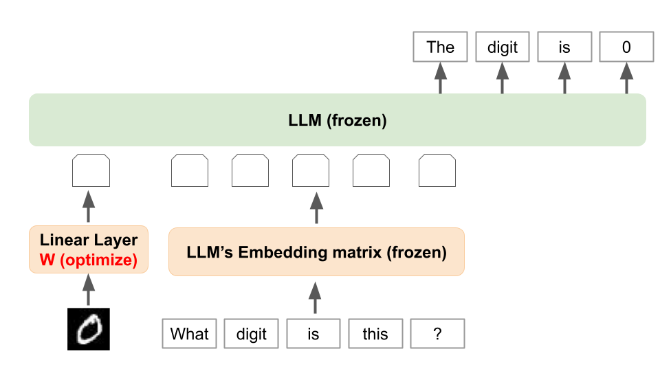

# llava-mnist



llava-mnist is a simple example of Vision and Language model using LLaVA architecture trained on MNIST dataset.

You can find the pre-trained model on Hugging Face: [speed/llava-mnist](https://huggingface.co/speed/llava-mnist)

## Components
The Llava architecture consists of two components:
- Vision Encoder: a model that transforms the digit image into an embedding vector that resides in the same space as the text token embedding.
- Language Model: a model that processes the text input and the vision embedding.

In this example, we use the following models for each components:
- Vision Encoder: one linear layer (Optimized for MNIST dataset), that takes a 28x28 image and outputs a 4096-dimensional embedding.
- Language Model: meta-llama/Meta-Llama-3.1-8B-Instruct (Frozen)


## Dataset
We use the *chat-style* MNIST dataset that is defined as follows:
- prompt: “<image>What digit is this?”

- output: "The digit is {label}."

## Loss Function
The loss function is defined as follows:

$L(W)=-\log P_W(\text{This digit is \{label\}}|\text{<image>What digit is this?})$

where $W$ is the vision encoder model's parameters, $P_W$ is the model's prediction, and $label$ is the ground truth label of the image.


## How to use


### Train the model
During training, only the vision encoder model is trained. The Language Model is frozen.
```bash
$ python3 src/llava_mnist/train.py
```


### Evaluate the performance of the trained model on MNIST dataset
```bash
$ python3 src/llava_mnist/evaluate_llama.py
```

You can change the question string by using the `--question` option.
```bash
$ python3 src/llava_mnist/evaluate_llama.py --question "What is this number?"
```


### Evaluate the performance of the llava-hf/llava-1.5-7b-hf model on MNIST dataset
```bash
$ python3 src/llava_mnist/evaluate_llava.py
```


## References
- Liu et al., LLaVA: Large Language and Vision Assistant, https://llava-vl.github.io/
- https://huggingface.co/dacorvo/mnist-mlp
- https://huggingface.co/speed/llava-mnist